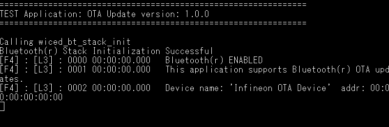
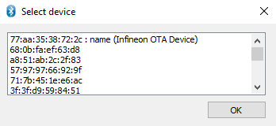
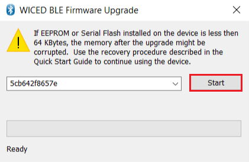
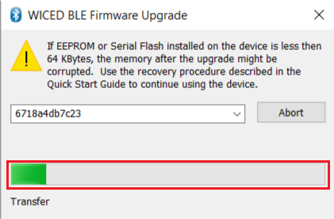
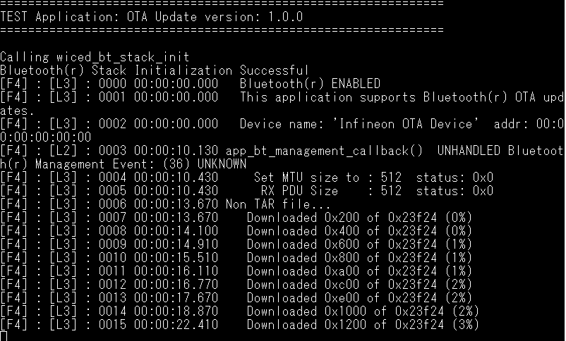
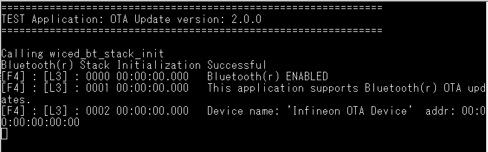
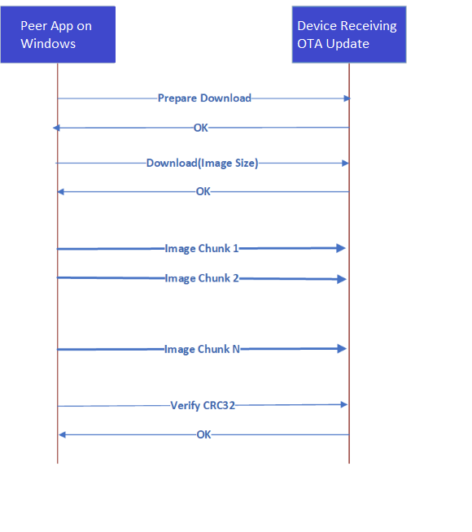

# Over-the-air firmware update using Bluetooth&reg; LE

This code example showcases how to perform an over-the-air (OTA) update using the CYW955913EVK-01 Evaluation Kit.
The evaluation kit runs an LED blinky task and a Bluetooth&reg; agent in the background. The OTA agent allows for remote updates to push to devices, which is a useful feature for IoT applications where physical access to devices is limited. The LED blinky task can continue to run even while an OTA download is happening, meaning that the device can still function normally while updates are taking place.


[View this README on GitHub.](https://github.com/Infineon/mtb-example-threadx-empty-app)

[Provide feedback on this code example.](https://cypress.co1.qualtrics.com/jfe/form/SV_1NTns53sK2yiljn?Q_EED=eyJVbmlxdWUgRG9jIElkIjoiQ0UyMzcxODkiLCJTcGVjIE51bWJlciI6IjAwMi0zNzE4OSIsIkRvYyBUaXRsZSI6IkVtcHR5IGFwcGxpY2F0aW9uIHRlbXBsYXRlIiwicmlkIjoiYW1hbCBtaXNocmEiLCJEb2MgdmVyc2lvbiI6IjEuMS4wIiwiRG9jIExhbmd1YWdlIjoiRW5nbGlzaCIsIkRvYyBEaXZpc2lvbiI6Ik1DRCIsIkRvYyBCVSI6IklDVyIsIkRvYyBGYW1pbHkiOiJXSUZJIn0=)


## Requirements

- [ModusToolbox&trade; software](https://www.infineon.com/modustoolbox) v3.2 or later (tested with v3.2) with ModusToolbox&trade;.
- Board support package (BSP) minimum required version for : v1.0.0.
- Programming language: C
- Associated parts: CYW955913EVK-01


## Supported toolchains (make variable 'TOOLCHAIN')

- GNU Arm&reg; Embedded Compiler v11.3.1 (`GCC_ARM`) – Default value of `TOOLCHAIN`


## Supported kits (make variable 'TARGET')
- [CYW955913EVK-01 Wi-Fi Bluetooth&reg; Prototyping Kit](https://www.infineon.com/CYW955913EVK-01) (`CYW955913EVK-01`)


## Hardware setup

This example uses the kit’s default configuration. See the kit guide to ensure that the kit is configured correctly.

> **Note:** The CYW955513EVK-01 Wi-Fi Bluetooth&reg; prototyping kit ships with KitProg3 version 2.30 installed. ModusToolbox&trade; requires KitProg3. Before using this code example, make sure that the board is upgraded to KitProg3. The tool and instructions are available in the [Firmware Loader](https://github.com/Infineon/Firmware-loader) GitHub repository. If you do not upgrade, you will see an error like "unable to find CMSIS-DAP device" or "KitProg firmware is out of date".


## Software setup

See the [ModusToolbox&trade; tools package installation guide](https://www.infineon.com/ModusToolboxInstallguide) for information about installing and configuring the tools package.


Install a terminal emulator if you don't have one. Instructions in this document use [Tera Term](https://ttssh2.osdn.jp/index.html.en).

This example requires no additional software or tools.

## Using the code example

### Create the project

The ModusToolbox&trade; tools package provides the Project Creator as both a GUI tool and a command line tool.

<details><summary><b>Use Project Creator GUI</b></summary>

1. Open the Project Creator GUI tool.

   There are several ways to do this, including launching it from the dashboard or from inside the Eclipse IDE. For more details, see the [Project Creator user guide](https://www.infineon.com/ModusToolboxProjectCreator) (locally available at *{ModusToolbox&trade; install directory}/tools_{version}/project-creator/docs/project-creator.pdf*).

2. On the **Choose Board Support Package (BSP)** page, select a kit supported by this code example. See [Supported kits](#supported-kits-make-variable-target).

   > **Note:** To use this code example for a kit not listed here, you may need to update the source files. If the kit does not have the required resources, the application may not work.

3. On the **Select Application** page:

   a. Select the **Applications(s) Root Path** and the **Target IDE**.

   > **Note:** Depending on how you open the Project Creator tool, these fields may be pre-selected for you.

   b.	Select this code example from the list by enabling its check box.

   > **Note:** You can narrow the list of displayed examples by typing in the filter box.

   c. (Optional) Change the suggested **New Application Name** and **New BSP Name**.

   d. Click **Create** to complete the application creation process.

</details>

<details><summary><b>Use Project Creator CLI</b></summary>

The 'project-creator-cli' tool can be used to create applications from a CLI terminal or from within batch files or shell scripts. This tool is available in the *{ModusToolbox&trade; install directory}/tools_{version}/project-creator/* directory.

Use a CLI terminal to invoke the 'project-creator-cli' tool. On Windows, use the command-line 'modus-shell' program provided in the ModusToolbox&trade; installation instead of a standard Windows command-line application. This shell provides access to all ModusToolbox&trade; tools. You can access it by typing "modus-shell" in the search box in the Windows menu. In Linux and macOS, you can use any terminal application.

-The following example clones the "[mtb-example-btstack-threadx-le-ota](https://github.com/Infineon/mtb-example-threadx-le-ota)" application with the desired name "Threadx_Le_OTA" configured for the *CYW955913EVK-01* BSP into the specified working directory, *C:/mtb_projects*:

   ```
   project-creator-cli --board-id CYW955913EVK-01 --app-id mtb-example-threadx-le-ota --user-app-name Threadx_Le_OTA --target-dir "C:/mtb_projects"
   ```

<mark>Update the above paragraph and commands to match your CE.

The 'project-creator-cli' tool has the following arguments:

Argument | Description | Required/optional
---------|-------------|-----------
`--board-id` | Defined in the <id> field of the [BSP](https://github.com/Infineon?q=bsp-manifest&type=&language=&sort=) manifest | Required
`--app-id`   | Defined in the <id> field of the [CE](https://github.com/Infineon?q=ce-manifest&type=&language=&sort=) manifest | Required
`--target-dir`| Specify the directory in which the application is to be created if you prefer not to use the default current working directory | Optional
`--user-app-name`| Specify the name of the application if you prefer to have a name other than the example's default name | Optional

> **Note:** The project-creator-cli tool uses the `git clone` and `make getlibs` commands to fetch the repository and import the required libraries. For details, see the "Project creator tools" section of the [ModusToolbox&trade; tools package user guide](https://www.infineon.com/ModusToolboxUserGuide) (locally available at {ModusToolbox&trade; install directory}/docs_{version}/mtb_user_guide.pdf).

</details>


### Open the project

After the project has been created, you can open it in your preferred development environment.


<details><summary><b>Eclipse IDE</b></summary>

If you opened the Project Creator tool from the included Eclipse IDE, the project will open in Eclipse automatically.

For more details, see the [Eclipse IDE for ModusToolbox&trade; user guide](https://www.infineon.com/MTBEclipseIDEUserGuide) (locally available at *{ModusToolbox&trade; install directory}/docs_{version}/mt_ide_user_guide.pdf*).

</details>


<details><summary><b>Visual Studio (VS) Code</b></summary>

Launch VS Code manually, and then open the generated *{project-name}.code-workspace* file located in the project directory.

For more details, see the [Visual Studio Code for ModusToolbox&trade; user guide](https://www.infineon.com/MTBVSCodeUserGuide) (locally available at *{ModusToolbox&trade; install directory}/docs_{version}/mt_vscode_user_guide.pdf*).

</details>


<details><summary><b>Keil µVision</b></summary>

Double-click the generated *{project-name}.cprj* file to launch the Keil µVision IDE.

For more details, see the [Keil µVision for ModusToolbox&trade; user guide](https://www.infineon.com/MTBuVisionUserGuide) (locally available at *{ModusToolbox&trade; install directory}/docs_{version}/mt_uvision_user_guide.pdf*).

</details>


<details><summary><b>IAR Embedded Workbench</b></summary>

Open IAR Embedded Workbench manually, and create a new project. Then select the generated *{project-name}.ipcf* file located in the project directory.

For more details, see the [IAR Embedded Workbench for ModusToolbox&trade; user guide](https://www.infineon.com/MTBIARUserGuide) (locally available at *{ModusToolbox&trade; install directory}/docs_{version}/mt_iar_user_guide.pdf*).

</details>


<details><summary><b>Command line</b></summary>

If you prefer to use the CLI, open the appropriate terminal, and navigate to the project directory. On Windows, use the command-line 'modus-shell' program; on Linux and macOS, you can use any terminal application. From there, you can run various `make` commands.

For more details, see the [ModusToolbox&trade; tools package user guide](https://www.infineon.com/ModusToolboxUserGuide) (locally available at *{ModusToolbox&trade; install directory}/docs_{version}/mtb_user_guide.pdf*).

</details>


## Operation

1. Connect the board to your PC using the provided USB cable through the KitProg3 USB connector.
2. Program the board using one of the following:

      <details><summary><b>Using Eclipse IDE</b></summary>

             1. Select the application project in the Project Explorer.

             2. In the **Quick Panel**, scroll down, and click **\<Application Name> Program**.
   </details>


   <details><summary><b>In other IDEs</b></summary>

   Follow the instructions in your preferred IDE.
   </details>


   <details><summary><b>Using CLI</b></summary>

     From the terminal, execute the `make program` command to build and program the application using the default toolchain to the default target. The default toolchain and target are specified in the application's Makefile but you can override those values manually:
      ```
      make program TOOLCHAIN=<toolchain>
      ```

      Example:
      ```
      make program TOOLCHAIN=GCC_ARM
      ```
   </details>
   
   After programming , reset the board and Observe the messages on the UART terminal .

      **Figure 1. Terminal Output**

      

3. For preparing the OTA update image, do the following changes to the app:

   1. Change the LED Blink rate by modifying the `BLINKY_DELAY_MS` define present in *led_task.c* to `2000`. This shows that the LED Blink rate decreased by half.

   2. Update the app version number in the Makefile by changing the `APP_VERSION_MAJOR`, `APP_VERSION_MINOR`, and `APP_VERSION_BUILD?`. In this example, update the version to 2.0.0 by modifying `MAJOR VERSION` to `2`.

   3. Build the app, but **do not program**. This version of the app will be used to push to the device via the peer Windows app (*WsOtaUpgrade.exe*).

   4. In the project directory, navigate to *build/\<TARGET>/Config* and locate the *.bin* file. Copy this file to the same directory as the peer app (*WsOtaUpgrade.exe*). It is located at */scripts/Bluetooth* directory and rename it to the *ota-update.bin* file.

   5. Open the terminal and navigate to *WsOtaUpgrade.exe*. Initiate the update process by issuing the following command:
      ```
      ./WsOtaUpgrade.exe <App_name>.bin
      ```

      **Note:** On Linux and macOS, you can use any terminal application. On Windows, open the *modus-shell* app from the Start menu.

   6. In the dialog box that appears, select your device (Infineon OTA Device) and click **OK** . In the next window, select **Start** to begin pushing the OTA update image to the device.

   **Figure 2. WsOtaUpgrade app**

   

      **Note:** Reset the board if it fails to display the device name on the dialogue box.


   **Figure 3. WsOtaUpgrade app start**

   

   You can monitor the progress on the Windows peer app via the progress bar or via the device terminal, which prints the percentage of download completed.

   **Figure 4. WsOtaUpgrade progress bar**

   

   **Figure 5. Terminal Output While Performing OTA Download**

   


   Once the download is completed, the device will reboot.

7. Observe the terminal for upgrade logs and LED Blink rate . Notice led blink rate and the updated app version in the terminal log once the app is launched on a successful update.

   **Figure 6. Terminal Output after OTA update**

   

## Design and implementation

This example implements LED blinky task and OTA firmware upgrade service .

1. LED blinky task: Led blinks at the rate specified by `BLINKY_DELAY_MS` macro.

2. OTA firmware upgrade service

   The OTA firmware upgrade service enables updating the application image remotely. A peer app on Windows/Android/iOS (currently, only Windows peer app is supported) can be used to push an OTA update to the device.

   The app downloads and writes the image to the secondary slot. On the next reboot, CYW955913EVK-01 boots up with the new image.

   **Figure 4. OTA image transfer sequence**

   

> **Note:** Thin lines in this diagram correspond to the messages sent using the Control Point characteristic. Thick lines indicate messages sent using the Data characteristic.

   Before performing the upgrade procedure, the peer app on the host should enable notifications and indications for the Control Point characteristic by writing the corresponding value to the Client Characteristic Configuration descriptor. If the peer app on the host uses a Bluetooth&reg; stack that does not allow the configuration of simultaneous notifications and indications, at least one of them must be configured.

   All multi-octet values (for example, the size of the image and CRC32 checksum) are sent in little-endian format.

   ## OTA upgrade procedure 

1. To start the upgrade, the peer app on the host sends the `CY_OTA_UPGRADE_COMMAND_PREPARE_DOWNLOAD` command (see tables 1 and 2 for details of the commands and events).

   This indicates that a new upgrade process is being started. The data received after that command is stored from the zero-offset position of the inactive logical memory partition. The OTA update library initializes the storage and clears the secondary storage on receiving this command.

2. After the peer app on the host receives the `CY_OTA_UPGRADE_STATUS_OK` message, it should send the `CY_OTA_UPGRADE_COMMAND_DOWNLOAD` command, passing four bytes specifying the memory image  size to be downloaded.

3. If `CY_OTA_UPGRADE_STATUS_OK` is received in the reply, the peer app on the host starts sending chunks of data.

4. After the final image chunk is sent, the peer app on the host sends the `CY_OTA_UPGRADE_COMMAND_VERIFY` command passing the image checksum calculated on the host. The library verifies the  stored image and sends the `CY_OTA_UPGRADE_STATUS_OK` or `CY_OTA_UPGRADE_STATUS_VERIFICATION_FAILED` message to the peer app on the host.

   - If verification is successful, the library marks the secondary storage as verified.
   - If the verification is not successful, the firmware sends a `CY_OTA_UPGRADE_STATUS_VERIFICATION_FAILED` status to the peer app on the host.

      Depending on whether `reboot_at_end` was set as `0` (do not automatically reboot after download) or `1` (reboot after download), the device will be rebooted. On the next reboot, MCUboot will pick up the image and perform the update.

   - If the download process is interrupted or if the verification fails, the embedded application continues its execution. To restart the process, the peer app on the host will need to start from the beginning by sending `CY_OTA_UPGRADE_COMMAND_PREPARE_DOWNLOAD`.

The following GATT procedures are used in the communication:

- All commands and data packets are sent from the peer app on the host to the embedded application using the GATT Write Request procedure.

- All the messages to the peer app on the host except for the final verification message (`CY_OTA_UPGRADE_STATUS_OK`) are sent using the GATT Notification procedure.

- The verification `OK` message is sent using the GATT Indication procedure.

- If the peer app on the host enabled notifications and did not allow indications, the verification message (`CY_OTA_UPGRADE_STATUS_OK`) is sent using the GATT Notify procedure.

For a better performance, it is recommended that the peer app on the host negotiates the largest possible MTU and sends data chunks of (MTU minus 3) octets.

**Table 1. OTA firmware upgrade commands**

 Command name |   Value| Paramaeters
:-----|:------|:------
`WICED_OTA_UPGRADE_COMMAND_PREPARE_DOWNLOAD`|   1  |  None             
`WICED_OTA_UPGRADE_COMMAND_DOWNLOAD`        |   2  |  4-byte image size
`WICED_OTA_UPGRADE_COMMAND_VERIFY`          |   3  |  4-byte CRC32     
`WICED_OTA_UPGRADE_COMMAND_ABORT`           |   7  |  None             

<br>

**Table 2. OTA firmware upgrade events**

Event name |   Value| Paramaeters
:-----|:------|:------
`WICED_OTA_UPGRADE_STATUS_OK`                 |  0 |  
`WICED_OTA_UPGRADE_STATUS_UNSUPPORTED_COMMAND`|  1 |            
`WICED_OTA_UPGRADE_STATUS_ILLEGAL_STATE`      |  2 |  
`WICED_OTA_UPGRADE_STATUS_VERIFICATION_FAILED`|  3 |     
`WICED_OTA_UPGRADE_STATUS_INVALID_IMAGE`      |  4 |      

<br>

## Other resources


Infineon provides a wealth of data at [www.infineon.com](https://www.infineon.com) to help you select the right device, and quickly and effectively integrate it into your design.
## Related resources


Resources  | Links
-----------|----------------------------------
Device documentation | Contact [Infineon Support](https://www.infineon.com/cms/en/about-infineon/company/contacts/support/)for device documentation
Development kits | Contact [Infineon Support](https://www.infineon.com/cms/en/about-infineon/company/contacts/support/) for kit samples
Libraries on GitHub  | [mtb-pdl-cat5](https://github.com/Infineon/mtb-pdl-cat5) – CYW55913 Peripheral Driver Library (PDL)  <br> [mtb-hal-cat5](https://github.com/Infineon/mtb-hal-cat5) – Hardware Abstraction Layer (HAL) library <br> [retarget-io](https://github.com/Infineon/retarget-io) – Utility library to retarget STDIO messages to a UART port
Tools  | [ModusToolbox&trade;](https://www.infineon.com/modustoolbox) – ModusToolbox&trade; software is a collection of easy-to-use libraries and tools enabling rapid development with Infineon MCUs for applications ranging from wireless and cloud-connected systems, edge AI/ML,embedded sense and control, to wired USB connectivity using PSoC&trade; Industrial/IoT MCUs, AIROC&trade; Wi-Fi and Bluetooth&reg; connectivity devices, XMC&trade; Industrial MCUs, and EZ-USB&trade;/EZ-PD&trade; wired connectivity controllers. ModusToolbox&trade; incorporates a comprehensive set of BSPs, HAL, libraries, configuration tools, and provides support for industry-standard IDEs to fast-track your embedded application development.

<br>


## Other resources

Infineon provides a wealth of data at [www.infineon.com](https://www.infineon.com) to help you select the right device, and quickly and effectively integrate it into your design.


## Document history

Document title: *CE239612* – *Over-the-air firmware update using Bluetooth&reg; LE*

 Version | Description of change
 ------- | ---------------------
 1.0.0   | New code example

<br>


All referenced product or service names and trademarks are the property of their respective owners.

The Bluetooth&reg; word mark and logos are registered trademarks owned by Bluetooth SIG, Inc., and any use of such marks by Infineon is under license.


---------------------------------------------------------

© Cypress Semiconductor Corporation, 2024. This document is the property of Cypress Semiconductor Corporation, an Infineon Technologies company, and its affiliates ("Cypress").  This document, including any software or firmware included or referenced in this document ("Software"), is owned by Cypress under the intellectual property laws and treaties of the United States and other countries worldwide.  Cypress reserves all rights under such laws and treaties and does not, except as specifically stated in this paragraph, grant any license under its patents, copyrights, trademarks, or other intellectual property rights.  If the Software is not accompanied by a license agreement and you do not otherwise have a written agreement with Cypress governing the use of the Software, then Cypress hereby grants you a personal, non-exclusive, nontransferable license (without the right to sublicense) (1) under its copyright rights in the Software (a) for Software provided in source code form, to modify and reproduce the Software solely for use with Cypress hardware products, only internally within your organization, and (b) to distribute the Software in binary code form externally to end users (either directly or indirectly through resellers and distributors), solely for use on Cypress hardware product units, and (2) under those claims of Cypress's patents that are infringed by the Software (as provided by Cypress, unmodified) to make, use, distribute, and import the Software solely for use with Cypress hardware products.  Any other use, reproduction, modification, translation, or compilation of the Software is prohibited.
<br>
TO THE EXTENT PERMITTED BY APPLICABLE LAW, CYPRESS MAKES NO WARRANTY OF ANY KIND, EXPRESS OR IMPLIED, WITH REGARD TO THIS DOCUMENT OR ANY SOFTWARE OR ACCOMPANYING HARDWARE, INCLUDING, BUT NOT LIMITED TO, THE IMPLIED WARRANTIES OF MERCHANTABILITY AND FITNESS FOR A PARTICULAR PURPOSE.  No computing device can be absolutely secure.  Therefore, despite security measures implemented in Cypress hardware or software products, Cypress shall have no liability arising out of any security breach, such as unauthorized access to or use of a Cypress product. CYPRESS DOES NOT REPRESENT, WARRANT, OR GUARANTEE THAT CYPRESS PRODUCTS, OR SYSTEMS CREATED USING CYPRESS PRODUCTS, WILL BE FREE FROM CORRUPTION, ATTACK, VIRUSES, INTERFERENCE, HACKING, DATA LOSS OR THEFT, OR OTHER SECURITY INTRUSION (collectively, "Security Breach").  Cypress disclaims any liability relating to any Security Breach, and you shall and hereby do release Cypress from any claim, damage, or other liability arising from any Security Breach.  In addition, the products described in these materials may contain design defects or errors known as errata which may cause the product to deviate from published specifications. To the extent permitted by applicable law, Cypress reserves the right to make changes to this document without further notice. Cypress does not assume any liability arising out of the application or use of any product or circuit described in this document. Any information provided in this document, including any sample design information or programming code, is provided only for reference purposes.  It is the responsibility of the user of this document to properly design, program, and test the functionality and safety of any application made of this information and any resulting product.  "High-Risk Device" means any device or system whose failure could cause personal injury, death, or property damage.  Examples of High-Risk Devices are weapons, nuclear installations, surgical implants, and other medical devices.  "Critical Component" means any component of a High-Risk Device whose failure to perform can be reasonably expected to cause, directly or indirectly, the failure of the High-Risk Device, or to affect its safety or effectiveness.  Cypress is not liable, in whole or in part, and you shall and hereby do release Cypress from any claim, damage, or other liability arising from any use of a Cypress product as a Critical Component in a High-Risk Device. You shall indemnify and hold Cypress, including its affiliates, and its directors, officers, employees, agents, distributors, and assigns harmless from and against all claims, costs, damages, and expenses, arising out of any claim, including claims for product liability, personal injury or death, or property damage arising from any use of a Cypress product as a Critical Component in a High-Risk Device. Cypress products are not intended or authorized for use as a Critical Component in any High-Risk Device except to the limited extent that (i) Cypress's published data sheet for the product explicitly states Cypress has qualified the product for use in a specific High-Risk Device, or (ii) Cypress has given you advance written authorization to use the product as a Critical Component in the specific High-Risk Device and you have signed a separate indemnification agreement.
<br>
Cypress, the Cypress logo, and combinations thereof, ModusToolbox, PSoC, CAPSENSE, EZ-USB, F-RAM, and TRAVEO are trademarks or registered trademarks of Cypress or a subsidiary of Cypress in the United States or in other countries. For a more complete list of Cypress trademarks, visit www.infineon.com. Other names and brands may be claimed as property of their respective owners.
